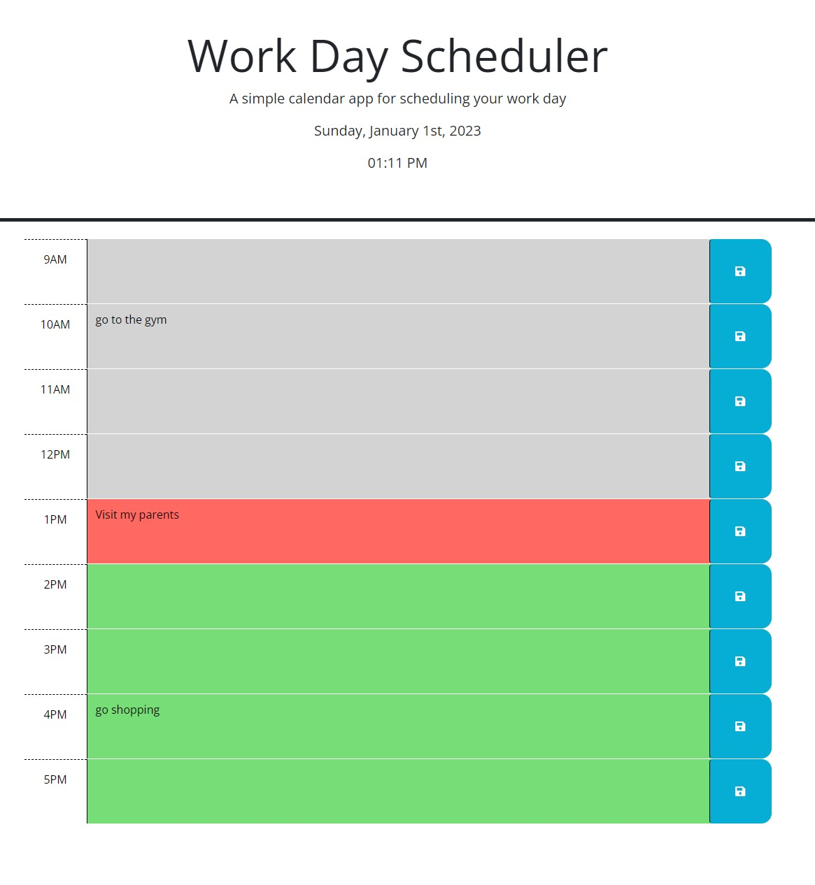

# Work_Day_Scheduler

## Description
Simple calendar application that allows a user to save events for each hour of the day

* **The current day is displayed at the top of the calendar.**
* **Present timeblocks for standard business hours.**
* **Each timeblock is color coded to indicate whether it is in the past, present, or future.**
* **You can enter an event.**
* **You can save the text for that event in local storage.**
* **the saved events will persist.**

## Link
https://franklynsuriel.github.io/Work_Day_Scheduler/

## Installation
N/A

## Usage
To use this Work day scheduler, you can open it in a browser. The current day is dysplayed at the top of the calendar. You can scroll down
to the time-blocks. Each time-block is colored code: gray for past, red for present, and green for future. you can create an event in any 
of the time-block and save your event when the save button is clicked. Last any saved event will persist on the screen

The following image shows the web application's appearance and functionality:

## Credits
N/A

## License
MIT